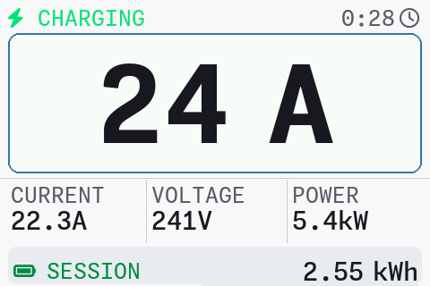
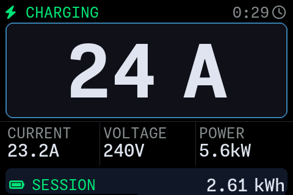

# ESP-EVSE

ESP-EVSE is a from-scratch firmware for the OpenEVSE WiFi TFT board with the 3.5" color LCD, built on top of ESPHome. It replaces the stock ESP32-side firmware with an implementation designed for seamless Home Assistant integration while still talking to the OpenEVSE controller over RAPI.


## Screenshots

| Light | Dark |
|-------|------|
|  |  |

## Features

- Native ESPHome / Home Assistant integration with automatic discovery, OTA updates, and device metadata
- Real-time charger telemetry in HA: EVSE state, pilot state, charging current, temperature, energy usage, and firmware version
- HA controls for charging current, configured current limits, service level, ammeter calibration, and persistent safety feature flags
- Custom TFT UI and NeoPixel status indicators on the display board
- Support for multiple chargers from the same codebase, with per-device configs such as `ev1.yaml` and `ev2.yaml`

## Install

Requirements:

- [uv](https://docs.astral.sh/uv/getting-started/installation/)

Clone this repo:

```sh
git clone git@github.com:jamarju/esp-evse.git
cd esp-evse
```

Customize:

- `secrets.yaml` (use `secrets.yaml.example` as template): fill in your Wi-Fi settings here.
- ev1.yaml:
  - rename to your preferred hostname
  - set esphome's [device name and device friendly name](https://esphome.io/components/esphome/#configuration-variables)

## Flashing The TFT Board Via FT232 / USB-UART

First-time flash of the OpenEVSE WiFi TFT LCD board requires a FT232 / USB-UART adapter. Locate this header on the board:

- `IO19`
- `TX`
- `RX`
- `5-12V`
- no label
- `GND`

FT232 adapters usually have a jumper to set them to 3.3V or 5V. I recommend to set it to 5V and power the board through from USB via the FT232 adapter:

- `adapter TXD -> board RX`
- `adapter RXD -> board TX`
- `adapter GND -> board GND`
- `adapter 5V/VCC -> board 5-12V` if you want the adapter to power the TFT board

Alternatively, if the board is already powered externally, leave `VCC` disconnected and only connect `TX`, `RX` and `GND`.

If you are connecting the FT232 through the OpenEVSE-provided harness, beware of the actual pin order as `RX/TX` and `5-12V/no-label` are crossed on the other end.

To enter the ESP32 bootloader:

1. Hold `BOOT`
2. Press `RESET`
3. Release `RESET`
4. Release `BOOT`

Flash this ESP-EVSE firmware over serial:

```sh
uv run esphome run ev1.yaml --device /dev/cu.usbserial-XXXXX
```

## Flash via Wi-Fi

After the esphome has been flashed at least once you can flash over-the-air:

```sh
# Compile and flash over USB
uv run esphome run ev1.yaml
```

You may configure multiple OpenEVSEs, each one using its own hostname and device names. See `ev2.yaml` as an example.

The device should be discovered by your Home Assistant's esphome integration automatically.

## Optional / advanced

Optionally, if you use platformio and don't want to disrupt your existing environment at `~/.platformio`, you may point `PLATFORMIO_CORE_DIR` to a different location, eg.

```sh
export PLATFORMIO_CORE_DIR=$(pwd)/.platformio
```


The firmware version reported to Home Assistant lives directly in [openevse-tft.yaml](openevse-tft.yaml). `uv run esphome ...` is the stock ESPHome CLI again; `pyproject.toml` is only used for the local tooling environment.

## Ammeter Calibration

Launch the calibration notebook as a read-only app:

```sh
uv run marimo run scripts/calibration.py
```

This opens the notebook in app mode, not in the editor. It shows an editable table, the calculated `scale_factor` / `offset`, and a live plot.

Measurement flow:

- In Home Assistant, find the number entities named `Current Scale Factor` and `Current Offset`, and enter those current values into the first two inputs in the app
- Put a clamp meter around either live or neutral
- Try a few charging current setpoints across the usable range; more points give a better fit
- In the table, add one row per measurement pair
- Enter `reported_A` from the `EV Charging Current` sensor in Home Assistant and `measured_A` from the clamp meter
- As you type, the regression reruns and the results update automatically

The plot shows `x = reported current`, `y = measured current`, and the dashed line is the regression fit.

## LED Strip Status Indicators

The NeoPixel LEDs signal the charger state, visible from a distance:

| Situation | Color | Animation |
|-----------|-------|-----------|
| Charging | Green | Breathing (3s cycle) |
| Connected, EVSE disabled (e.g. no solar surplus) | Blue | Solid dim |
| Connected, charge complete | Green | Solid |
| Not connected, EVSE disabled | Off | — |
| Not connected, EVSE enabled (ready) | Cyan | Slow breathing (4s) |
| Starting / booting | Blue | Fast breathing (1.5s) |
| Sleeping | Blue | Very slow breathing (6s) |
| Error (GFI fault, stuck relay, etc.) | Red | Fast blink (~3Hz) |
| Over temperature / over current | Orange | Slow blink (~1Hz) |

## Development

Preview the next firmware version from conventional commits:

```sh
python3 scripts/bump_firmware_version.py
```

Compile only:

```sh
uv run esphome compile ev1.yaml
```

Compile and flash OTA to a specific device

```sh
uv run esphome run ev1.yaml --device ev1.local
```

View logs

```sh
uv run esphome logs ev1.yaml --device ev1.local
```

## Contributing

CI will autobump the semver in `openevse-tft.yaml` from conventional commits:

- `fix:` and `perf:` -> patch
- `feat:` -> minor
- `!` or `BREAKING CHANGE:` -> major
